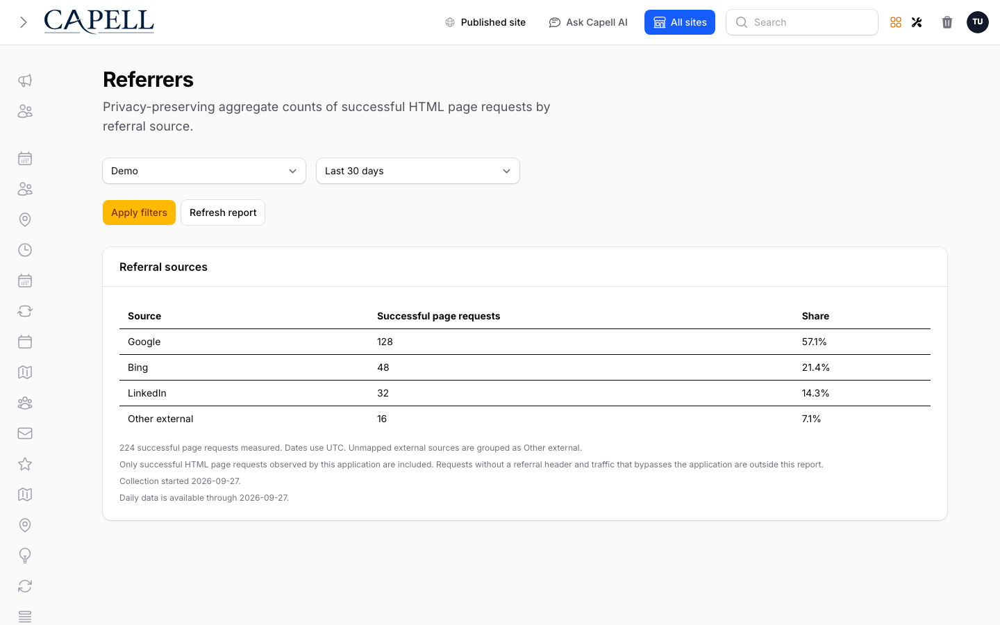

# Referers

<!-- prettier-ignore-start -->

## What This Plugin Adds

Referers is an **Available**, **Schema-owning** Capell package in the **Capell Marketing & Growth** product group. It ships as `capell-app/referer` and extends these surfaces: admin, frontend, console.

Referers adds privacy-preserving aggregate referral reporting to Capell. It keeps daily and lifetime counters for finite source keys without storing raw URLs or request identifiers.

Administrators review site-scoped referral counts in a cached Referrers report and a small dashboard widget, while origin frontend renders record successful HTML responses best-effort.

Status details:

- Status: Available
- Tier: free
- Bundle: marketing-growth
- Composer package: `capell-app/referer`
- Namespace: `Capell\Referer`
- Theme key: not applicable

## Why It Matters

**For developers:** Typed Actions, bounded validation, atomic upserts, and focused tests keep the privacy contract explicit at each boundary.

**For teams:** Site teams can see which configured external sources contribute successful page requests without receiving a browsing-event log.

## Screens And Workflow

Screenshot contract: `docs/screenshots.json`.

- Site-scoped referral source report (admin, required evidence).

## Technical Shape

### Service providers

- `Capell\Referer\Providers\RefererServiceProvider`
- `Capell\Referer\Providers\AdminServiceProvider`

### Config files

- `packages/referer/config/capell-referer.php`

### Migrations

- `packages/referer/database/migrations/2026_09_14_000001_create_referer_counts_tables.php`

### Models

- `RefererDailyCount`
- `RefererSourceTotal`

### Filament classes

- `RefererPage`
- `TopRefererSourcesFilamentWidget`

### Actions

- `BuildRefererReportAction`
- `PruneRefererCountsAction`
- `RecordRefererCountAction`
- `RefererHealthSignal`
- `ResolveRefererWindowAction`
- `ResolveReferralSourceAction`
- `SeedRefererScreenshotFixtureAction`

### Data objects

- `RefererReportData`
- `RefererReportRowData`
- `RefererWindowData`
- `ReferralSourceData`

### Command signatures

- `capell:referer:prune`
- `capell:referer:screenshot-fixture`

### Scheduled commands

- `capell:referer:prune (daily; package registered)`

### Console command classes

- `PruneRefererCountsCommand`
- `SeedRefererScreenshotFixtureCommand`

### Manifest contributions

- `admin-page: Capell\Referer\Manifest\RefererAdminPageContribution`
- `console-command: Capell\Referer\Manifest\RefererConsoleCommandsContribution`
- `dashboard-widget: Capell\Referer\Manifest\RefererDashboardFilamentWidgetsContribution`
- `health-check: Capell\Referer\Manifest\RefererHealthContribution`
- `migration: Capell\Referer\Manifest\RefererMigrationsContribution`
- `model: Capell\Referer\Manifest\RefererModelsContribution`
- `permission: Capell\Referer\Manifest\RefererPermissionsContribution`
- `scheduled-job: Capell\Referer\Manifest\RefererRetentionScheduleContribution`

### Health checks

- `Capell\Referer\Health\RefererHealthCheck`

### Blade views

- `packages/referer/resources/views/filament/pages/referer.blade.php`

### Cache tags

- `referer`

## Data Model

- Required tables: `referer_daily_counts`, `referer_source_totals`, `referer_retention_state`.
- Models: `RefererDailyCount`, `RefererSourceTotal`.
- Core record references in migrations: `sites via site_id`.
- Migration files: `2026_09_14_000001_create_referer_counts_tables.php`.
- Migration impact: run host migrations through the package install flow before opening package surfaces.
- Deletion/retention behaviour: migrations declare cascade-on-delete relationships; retention is scheduled through `capell:referer:prune` (daily; registered by the package provider).

## Install Impact

- Required packages: `capell-app/admin`, `capell-app/core`, `capell-app/frontend`.
- Admin navigation: declares `admin-page: RefererAdminPageContribution`; each Filament page or resource controls its own navigation visibility.
- Admin/editor extensions: `dashboard-widget: RefererDashboardFilamentWidgetsContribution`.
- Permissions: `View:RefererPage`; Shield-generated page permissions for `Capell\Referer\Filament\Pages\RefererPage` (names and grants depend on host Shield configuration).
- Public routes: none declared.
- Database changes: package migrations are declared.
- Config: `config/capell-referer.php`.
- Settings: no package settings declared.
- Queues or schedules: scheduled commands `capell:referer:prune (daily; package registered)`.
- Cache tags: `referer`.
- Commands: `capell:referer:prune`, `capell:referer:screenshot-fixture`.

## Common Pitfalls

- Keep required Capell packages on compatible v4 releases: `capell-app/admin`, `capell-app/core`, `capell-app/frontend`.
- Run migrations before opening package resources or public routes.
- Review package configuration before production-like verification: `config/capell-referer.php`.
- Keep the host Laravel scheduler running so package-registered schedules can execute: `capell:referer:prune (daily; package registered)`.
- Keep public Blade and cached HTML free of authoring markers, model IDs, permissions, signed editor URLs, and lazy database queries.
- Custom write integrations must preserve invalidation for `referer` cache tags.

## Troubleshooting

| Symptom | Likely cause | Check | Fix |
| --- | --- | --- | --- |
| Package surface is missing after install | Provider or manifest is not loaded | Confirm `capell.json`, package `composer.json`, and provider registration | Reinstall the package, refresh Composer autoload, and clear host caches |
| Admin screen or command fails on missing table | Package migrations have not run | Check the tables listed in `Data Model` | Run host migrations and rerun the focused package test |
| Background work does not run | Queue worker or declared schedule is not active | Check the jobs and scheduled commands listed in `Technical Shape` | Start the queue worker or host scheduler, then run the focused command or package test |
| Public output leaks unexpected state | Render data, cache variation, or authoring boundary has regressed | Check public Blade, cache tags, and public-output safety tests | Move data loading out of Blade and rerun the package public-output tests |

## Quick Start

1. Install the package: `composer require capell-app/referer`.
2. See it working: run `php artisan capell:referer:screenshot-fixture`.
3. Open the package admin surface at `/admin/referer` and confirm Referers is available.

## Next Steps

- [Package docs](docs/README.md)
- [Overview](docs/overview.md)
- [Worked extension examples](docs/extension-contracts.md)
- [Admin guide](docs/admin-guide.md)
- Configuration files: [`config/capell-referer.php`](config/capell-referer.php).
- [Troubleshooting](#troubleshooting)
- [Screenshot contract](docs/screenshots.json)
- [Marketplace assets](docs/assets/marketplace/)
- [Capell content language plan](../../docs/CONTENT_LANGUAGE_PLAN.md)
- [Capell documentation design system](../../docs/DESIGN_SYSTEM.md)
- [Capell and package ERD notes](../../docs/erd/capell-and-package-erds.md)

<!-- prettier-ignore-end -->
